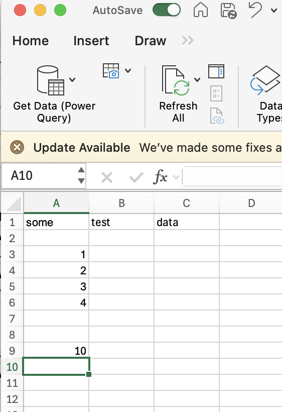
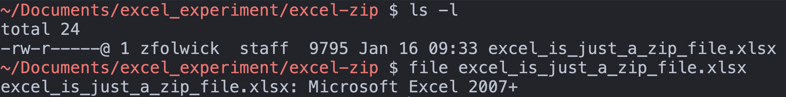
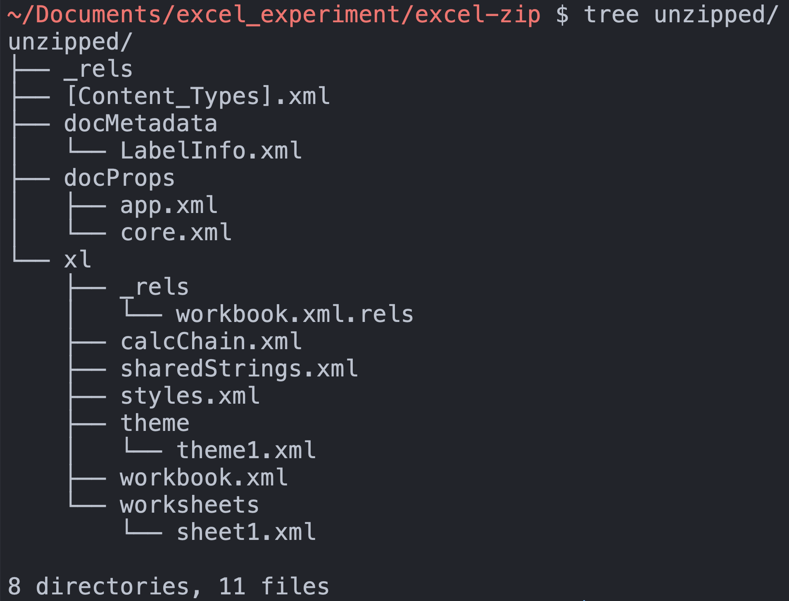
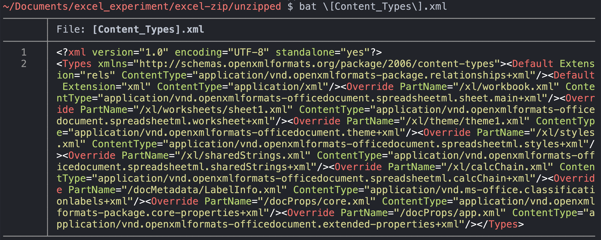
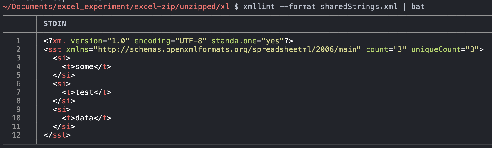

# Excel, unzipped

If you ever wondered why excel is slow when it gets large, imagine if your computer needed to open 12 different files. Excel is an xml relational database.

Here's one with some simple test data:

Now, going to my terminal, we can explore it using `ls -l` and `file` command:

Here we see it's just a file with read/write permissions and is an excel 2007 document.  Nothing interesting.

## peek inside

Using `unzip`, point it at the xlsx file.  I've made a directory called "unzipped" to output the contents for simplicity:

And indeed when showing the contents of `unzipped` directory, we see a whole structure has been created:

Most of these documents will look uninteresting and tedious:

But some of these contain interesting metadata if you're interested in digital forensics.  See docProps/core.xml for personal metadata of the document creator.

Additionally, the actual data of the spreadsheet lives in two sheets: text data is stored in xl/sharedStrings.xml:

While other data (such as numbers and calulation results), are stored in xml files in the `xl/worksheets/` directory:

Each time you open the document, you're first unzipping this into a temporary working directory, and then excel is piecing everything together and rendering it.  When you save a file, you're zipping it all up into a single file, and calling it "xlsx".

I wonder:
* can generate one from scratch?
* can we open the same file but change the xlsx extension and still open an excel file correctly?