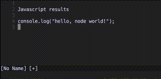
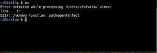

# Executing a script in vim

When executing a vim buffer window, I was able to show how to [run a bash script in vim](./vim-execute-script-in-register.md).  But there's no reason to stop at bash.

The discovered bash running script:
```bash
'<,'>t-1|'<,'>!bash
```


can be swapped out with anything else.

```bash
'<,'>t-1|'<,'>!python3
```


In fact, there's no reason it couldn't do :face_vomiting: javascript!

```javascript
'<,'>t-1|'<,'>!node
```



Next question: this definitely works with _interpreted_ languages.  Does this work with compiled languages as well?

But the next question: how long has this been supported in text editors?  Here it is working in the `ex` editor (first released in [1978](https://en.wikipedia.org/wiki/Ex_(text_editor)):



The `ed` editor from the 1960's also has this capability, but it's a bit different:


I see no reason this shouldn't also run python or node or lua or whatever.